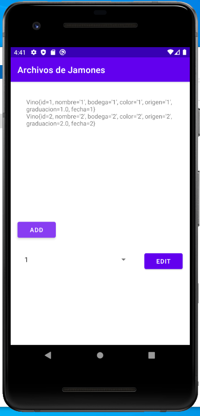
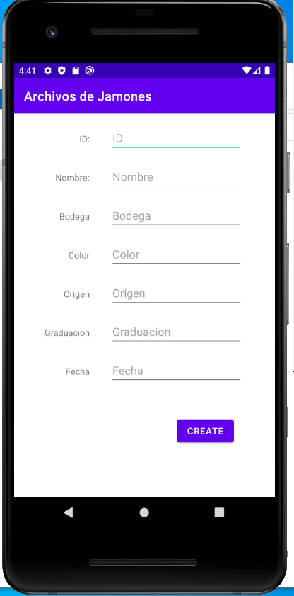
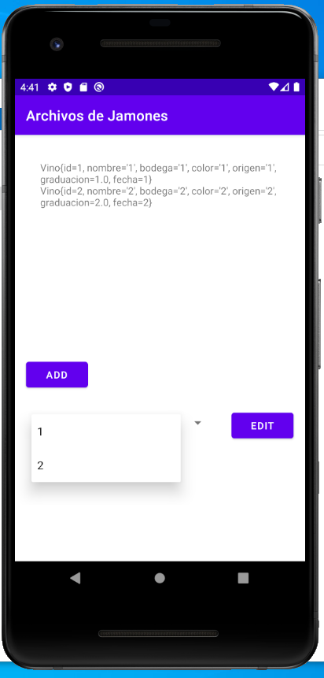

# ACDAT_ArchivoVinos

Un CRUD básico usando como almacenamiento un archivo csv local.

## Capturas 🚀

Capturas de la aplicación

### Inicio 📋

_Pantalla principal en la que muestra los vinos creados, un boton para añadir y un boton en el que editar el vino_

### Create

_Pantalla de creacion de vinos con EditText para rellenar los campos, con control de ID unicos integrado_

### Edit

_Pantalla de Editar vinos con la opcion de Editar o Borrar, id no modificable_
